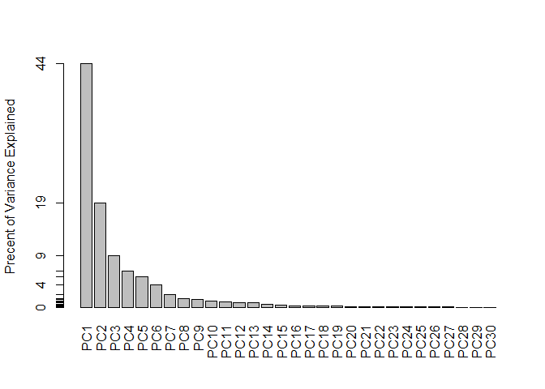
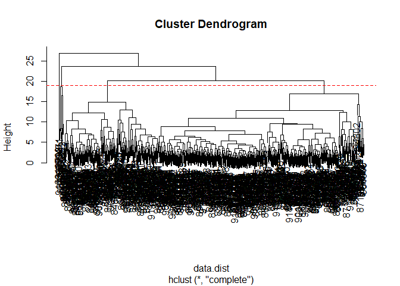
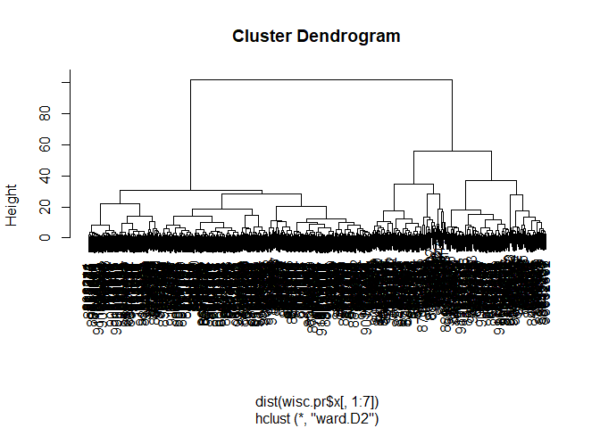
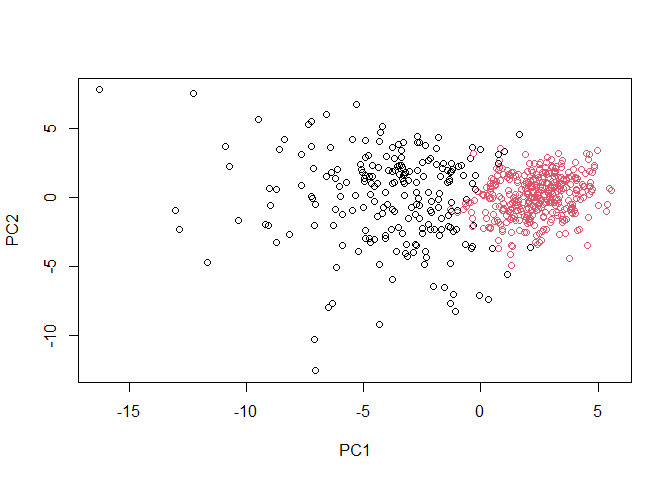
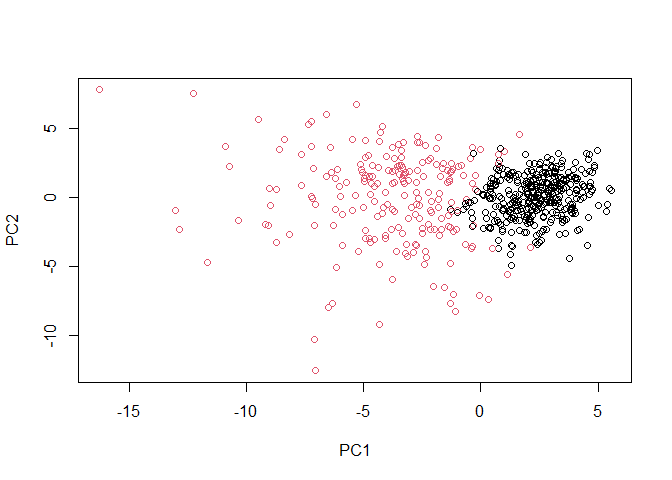

Unsupervised Learning
================
Claire Chapman
10/29/2021

## Preparing the Data

Reading in the data

``` r
fna.data <- "WisconsinCancer.csv"
wisc.df <- read.csv(fna.data, row.names = 1)
```

Examine the data

``` r
head(wisc.df)
```

<div data-pagedtable="false">

<script data-pagedtable-source type="application/json">
{"columns":[{"label":[""],"name":["_rn_"],"type":[""],"align":["left"]},{"label":["diagnosis"],"name":[1],"type":["chr"],"align":["left"]},{"label":["radius_mean"],"name":[2],"type":["dbl"],"align":["right"]},{"label":["texture_mean"],"name":[3],"type":["dbl"],"align":["right"]},{"label":["perimeter_mean"],"name":[4],"type":["dbl"],"align":["right"]},{"label":["area_mean"],"name":[5],"type":["dbl"],"align":["right"]},{"label":["smoothness_mean"],"name":[6],"type":["dbl"],"align":["right"]},{"label":["compactness_mean"],"name":[7],"type":["dbl"],"align":["right"]},{"label":["concavity_mean"],"name":[8],"type":["dbl"],"align":["right"]},{"label":["concave.points_mean"],"name":[9],"type":["dbl"],"align":["right"]},{"label":["symmetry_mean"],"name":[10],"type":["dbl"],"align":["right"]},{"label":["fractal_dimension_mean"],"name":[11],"type":["dbl"],"align":["right"]},{"label":["radius_se"],"name":[12],"type":["dbl"],"align":["right"]},{"label":["texture_se"],"name":[13],"type":["dbl"],"align":["right"]},{"label":["perimeter_se"],"name":[14],"type":["dbl"],"align":["right"]},{"label":["area_se"],"name":[15],"type":["dbl"],"align":["right"]},{"label":["smoothness_se"],"name":[16],"type":["dbl"],"align":["right"]},{"label":["compactness_se"],"name":[17],"type":["dbl"],"align":["right"]},{"label":["concavity_se"],"name":[18],"type":["dbl"],"align":["right"]},{"label":["concave.points_se"],"name":[19],"type":["dbl"],"align":["right"]},{"label":["symmetry_se"],"name":[20],"type":["dbl"],"align":["right"]},{"label":["fractal_dimension_se"],"name":[21],"type":["dbl"],"align":["right"]},{"label":["radius_worst"],"name":[22],"type":["dbl"],"align":["right"]},{"label":["texture_worst"],"name":[23],"type":["dbl"],"align":["right"]},{"label":["perimeter_worst"],"name":[24],"type":["dbl"],"align":["right"]},{"label":["area_worst"],"name":[25],"type":["dbl"],"align":["right"]},{"label":["smoothness_worst"],"name":[26],"type":["dbl"],"align":["right"]},{"label":["compactness_worst"],"name":[27],"type":["dbl"],"align":["right"]},{"label":["concavity_worst"],"name":[28],"type":["dbl"],"align":["right"]},{"label":["concave.points_worst"],"name":[29],"type":["dbl"],"align":["right"]},{"label":["symmetry_worst"],"name":[30],"type":["dbl"],"align":["right"]},{"label":["fractal_dimension_worst"],"name":[31],"type":["dbl"],"align":["right"]}],"data":[{"1":"M","2":"17.99","3":"10.38","4":"122.80","5":"1001.0","6":"0.11840","7":"0.27760","8":"0.3001","9":"0.14710","10":"0.2419","11":"0.07871","12":"1.0950","13":"0.9053","14":"8.589","15":"153.40","16":"0.006399","17":"0.04904","18":"0.05373","19":"0.01587","20":"0.03003","21":"0.006193","22":"25.38","23":"17.33","24":"184.60","25":"2019.0","26":"0.1622","27":"0.6656","28":"0.7119","29":"0.2654","30":"0.4601","31":"0.11890","_rn_":"842302"},{"1":"M","2":"20.57","3":"17.77","4":"132.90","5":"1326.0","6":"0.08474","7":"0.07864","8":"0.0869","9":"0.07017","10":"0.1812","11":"0.05667","12":"0.5435","13":"0.7339","14":"3.398","15":"74.08","16":"0.005225","17":"0.01308","18":"0.01860","19":"0.01340","20":"0.01389","21":"0.003532","22":"24.99","23":"23.41","24":"158.80","25":"1956.0","26":"0.1238","27":"0.1866","28":"0.2416","29":"0.1860","30":"0.2750","31":"0.08902","_rn_":"842517"},{"1":"M","2":"19.69","3":"21.25","4":"130.00","5":"1203.0","6":"0.10960","7":"0.15990","8":"0.1974","9":"0.12790","10":"0.2069","11":"0.05999","12":"0.7456","13":"0.7869","14":"4.585","15":"94.03","16":"0.006150","17":"0.04006","18":"0.03832","19":"0.02058","20":"0.02250","21":"0.004571","22":"23.57","23":"25.53","24":"152.50","25":"1709.0","26":"0.1444","27":"0.4245","28":"0.4504","29":"0.2430","30":"0.3613","31":"0.08758","_rn_":"84300903"},{"1":"M","2":"11.42","3":"20.38","4":"77.58","5":"386.1","6":"0.14250","7":"0.28390","8":"0.2414","9":"0.10520","10":"0.2597","11":"0.09744","12":"0.4956","13":"1.1560","14":"3.445","15":"27.23","16":"0.009110","17":"0.07458","18":"0.05661","19":"0.01867","20":"0.05963","21":"0.009208","22":"14.91","23":"26.50","24":"98.87","25":"567.7","26":"0.2098","27":"0.8663","28":"0.6869","29":"0.2575","30":"0.6638","31":"0.17300","_rn_":"84348301"},{"1":"M","2":"20.29","3":"14.34","4":"135.10","5":"1297.0","6":"0.10030","7":"0.13280","8":"0.1980","9":"0.10430","10":"0.1809","11":"0.05883","12":"0.7572","13":"0.7813","14":"5.438","15":"94.44","16":"0.011490","17":"0.02461","18":"0.05688","19":"0.01885","20":"0.01756","21":"0.005115","22":"22.54","23":"16.67","24":"152.20","25":"1575.0","26":"0.1374","27":"0.2050","28":"0.4000","29":"0.1625","30":"0.2364","31":"0.07678","_rn_":"84358402"},{"1":"M","2":"12.45","3":"15.70","4":"82.57","5":"477.1","6":"0.12780","7":"0.17000","8":"0.1578","9":"0.08089","10":"0.2087","11":"0.07613","12":"0.3345","13":"0.8902","14":"2.217","15":"27.19","16":"0.007510","17":"0.03345","18":"0.03672","19":"0.01137","20":"0.02165","21":"0.005082","22":"15.47","23":"23.75","24":"103.40","25":"741.6","26":"0.1791","27":"0.5249","28":"0.5355","29":"0.1741","30":"0.3985","31":"0.12440","_rn_":"843786"}],"options":{"columns":{"min":{},"max":[10]},"rows":{"min":[10],"max":[10]},"pages":{}}}
  </script>

</div>

Get rid of the “Diagnosis” column because we won’t be needing it

``` r
wisc.data <- wisc.df[,-1]
```

But store “Diagnosis” as a factor to be used later to check our work

``` r
diagnosis <- as.factor(wisc.df$diagnosis)
```

> Q1. How many observations are in this dataset?

``` r
dim(wisc.data)
```

    ## [1] 569  30

**569 observations**

> Q2. How many of the observations have a malignant diagnosis?

``` r
table(diagnosis)
```

    ## diagnosis
    ##   B   M 
    ## 357 212

> Q3. How many variables/features in the data are suffixed with \_mean?

``` r
length(grep("_mean", colnames(wisc.data)))
```

    ## [1] 10

## Principal Component Analysis

Checking column means and standard deviation

``` r
colMeans(wisc.data)
```

    ##             radius_mean            texture_mean          perimeter_mean 
    ##            1.412729e+01            1.928965e+01            9.196903e+01 
    ##               area_mean         smoothness_mean        compactness_mean 
    ##            6.548891e+02            9.636028e-02            1.043410e-01 
    ##          concavity_mean     concave.points_mean           symmetry_mean 
    ##            8.879932e-02            4.891915e-02            1.811619e-01 
    ##  fractal_dimension_mean               radius_se              texture_se 
    ##            6.279761e-02            4.051721e-01            1.216853e+00 
    ##            perimeter_se                 area_se           smoothness_se 
    ##            2.866059e+00            4.033708e+01            7.040979e-03 
    ##          compactness_se            concavity_se       concave.points_se 
    ##            2.547814e-02            3.189372e-02            1.179614e-02 
    ##             symmetry_se    fractal_dimension_se            radius_worst 
    ##            2.054230e-02            3.794904e-03            1.626919e+01 
    ##           texture_worst         perimeter_worst              area_worst 
    ##            2.567722e+01            1.072612e+02            8.805831e+02 
    ##        smoothness_worst       compactness_worst         concavity_worst 
    ##            1.323686e-01            2.542650e-01            2.721885e-01 
    ##    concave.points_worst          symmetry_worst fractal_dimension_worst 
    ##            1.146062e-01            2.900756e-01            8.394582e-02

``` r
apply(wisc.data, 2, sd)
```

    ##             radius_mean            texture_mean          perimeter_mean 
    ##            3.524049e+00            4.301036e+00            2.429898e+01 
    ##               area_mean         smoothness_mean        compactness_mean 
    ##            3.519141e+02            1.406413e-02            5.281276e-02 
    ##          concavity_mean     concave.points_mean           symmetry_mean 
    ##            7.971981e-02            3.880284e-02            2.741428e-02 
    ##  fractal_dimension_mean               radius_se              texture_se 
    ##            7.060363e-03            2.773127e-01            5.516484e-01 
    ##            perimeter_se                 area_se           smoothness_se 
    ##            2.021855e+00            4.549101e+01            3.002518e-03 
    ##          compactness_se            concavity_se       concave.points_se 
    ##            1.790818e-02            3.018606e-02            6.170285e-03 
    ##             symmetry_se    fractal_dimension_se            radius_worst 
    ##            8.266372e-03            2.646071e-03            4.833242e+00 
    ##           texture_worst         perimeter_worst              area_worst 
    ##            6.146258e+00            3.360254e+01            5.693570e+02 
    ##        smoothness_worst       compactness_worst         concavity_worst 
    ##            2.283243e-02            1.573365e-01            2.086243e-01 
    ##    concave.points_worst          symmetry_worst fractal_dimension_worst 
    ##            6.573234e-02            6.186747e-02            1.806127e-02

Perform PCA

``` r
wisc.pr <- prcomp(wisc.data, scale = T)
```

``` r
summary(wisc.pr)
```

    ## Importance of components:
    ##                           PC1    PC2     PC3     PC4     PC5     PC6     PC7
    ## Standard deviation     3.6444 2.3857 1.67867 1.40735 1.28403 1.09880 0.82172
    ## Proportion of Variance 0.4427 0.1897 0.09393 0.06602 0.05496 0.04025 0.02251
    ## Cumulative Proportion  0.4427 0.6324 0.72636 0.79239 0.84734 0.88759 0.91010
    ##                            PC8    PC9    PC10   PC11    PC12    PC13    PC14
    ## Standard deviation     0.69037 0.6457 0.59219 0.5421 0.51104 0.49128 0.39624
    ## Proportion of Variance 0.01589 0.0139 0.01169 0.0098 0.00871 0.00805 0.00523
    ## Cumulative Proportion  0.92598 0.9399 0.95157 0.9614 0.97007 0.97812 0.98335
    ##                           PC15    PC16    PC17    PC18    PC19    PC20   PC21
    ## Standard deviation     0.30681 0.28260 0.24372 0.22939 0.22244 0.17652 0.1731
    ## Proportion of Variance 0.00314 0.00266 0.00198 0.00175 0.00165 0.00104 0.0010
    ## Cumulative Proportion  0.98649 0.98915 0.99113 0.99288 0.99453 0.99557 0.9966
    ##                           PC22    PC23   PC24    PC25    PC26    PC27    PC28
    ## Standard deviation     0.16565 0.15602 0.1344 0.12442 0.09043 0.08307 0.03987
    ## Proportion of Variance 0.00091 0.00081 0.0006 0.00052 0.00027 0.00023 0.00005
    ## Cumulative Proportion  0.99749 0.99830 0.9989 0.99942 0.99969 0.99992 0.99997
    ##                           PC29    PC30
    ## Standard deviation     0.02736 0.01153
    ## Proportion of Variance 0.00002 0.00000
    ## Cumulative Proportion  1.00000 1.00000

> Q4. From your results, what proportion of the original variance is
> captured by the first principal components (PC1)?

**From row 2 of the summary above, PC1 accounts for 44.27%**

> Q5. How many principal components (PCs) are required to describe at
> least 70% of the original variance in the data?

**From row 3 of the summary above, 3 PCs are required to describe
&gt;70%**

> Q6. How many principal components (PCs) are required to describe at
> least 90% of the original variance in the data?

**From row 3 of the summary above, 7 PCs are required to describe
&gt;90%**

## Interpreting PCA Results

``` r
biplot(wisc.pr)
```

<!-- -->

> Q7. What stands out to you about this plot? Is it easy or difficult to
> understand? Why?

**There is way too much information on this plot for it to be understood
and to be useful.**

Let’s make a better plot

``` r
plot(wisc.pr$x[,1], wisc.pr$x[,2], col = diagnosis, xlab = "PC1", ylab = "PC2")
```

<!-- -->

> Q8. Generate a similar plot for principal components 1 and 3. What do
> you notice about these plots?

``` r
plot(wisc.pr$x[,1], wisc.pr$x[,3], col = diagnosis, xlab = "PC1", ylab = "PC3")
```

<!-- -->

### Using ggplot2 to make another plot

Turn the PCA into a dataframe, add back diagnosis as a column

``` r
df <- as.data.frame(wisc.pr$x)
df$diagnosis <- diagnosis
```

``` r
library(ggplot2)
```

Make a scatter plot colored by diagnosis

``` r
ggplot(df, aes(PC1, PC2, col = diagnosis)) +
  geom_point()
```

<!-- -->

## Variance Explained

Calculate variance of each component

``` r
pr.var <- wisc.pr$sdev^2
head(pr.var)
```

    ## [1] 13.281608  5.691355  2.817949  1.980640  1.648731  1.207357

Calculate the variance explained by each principal component

``` r
pve <- pr.var / sum(pr.var)
```

Plot variance explained for each principal component

``` r
plot(pve, xlab = "Principal Component", ylab = "Proportion of Variance Explained", ylim = c(0,1), type = "o")
```

<!-- -->

Alternative scree plot of the same data

``` r
barplot(pve, ylab = "Precent of Variance Explained", names.arg=paste0("PC",1:length(pve)), las=2, axes = FALSE)
axis(2, at=pve, labels=round(pve,2)*100 )
```

<!-- -->

### Exploring additional CRAN packages

``` r
#install.packages("factoextra")
library(factoextra)
```

    ## Welcome! Want to learn more? See two factoextra-related books at https://goo.gl/ve3WBa

``` r
fviz_eig(wisc.pr, addlabels = TRUE)
```

<!-- -->

## Communicating PCA Results

Loadings: vectors that explain the mapping from the original features to
the PC

> Q9. For the first principal component, what is the component of the
> loading vector (i.e. wisc.pr$rotation\[,1\]) for the feature
> concave.points\_mean?

``` r
wisc.pr$rotation[,1]
```

    ##             radius_mean            texture_mean          perimeter_mean 
    ##             -0.21890244             -0.10372458             -0.22753729 
    ##               area_mean         smoothness_mean        compactness_mean 
    ##             -0.22099499             -0.14258969             -0.23928535 
    ##          concavity_mean     concave.points_mean           symmetry_mean 
    ##             -0.25840048             -0.26085376             -0.13816696 
    ##  fractal_dimension_mean               radius_se              texture_se 
    ##             -0.06436335             -0.20597878             -0.01742803 
    ##            perimeter_se                 area_se           smoothness_se 
    ##             -0.21132592             -0.20286964             -0.01453145 
    ##          compactness_se            concavity_se       concave.points_se 
    ##             -0.17039345             -0.15358979             -0.18341740 
    ##             symmetry_se    fractal_dimension_se            radius_worst 
    ##             -0.04249842             -0.10256832             -0.22799663 
    ##           texture_worst         perimeter_worst              area_worst 
    ##             -0.10446933             -0.23663968             -0.22487053 
    ##        smoothness_worst       compactness_worst         concavity_worst 
    ##             -0.12795256             -0.21009588             -0.22876753 
    ##    concave.points_worst          symmetry_worst fractal_dimension_worst 
    ##             -0.25088597             -0.12290456             -0.13178394

**The loading vector for concave.points\_mean is -0.260**

> Q10. What is the minimum number of principal components required to
> explain 80% of the variance of the data?

``` r
summary(wisc.pr)
```

    ## Importance of components:
    ##                           PC1    PC2     PC3     PC4     PC5     PC6     PC7
    ## Standard deviation     3.6444 2.3857 1.67867 1.40735 1.28403 1.09880 0.82172
    ## Proportion of Variance 0.4427 0.1897 0.09393 0.06602 0.05496 0.04025 0.02251
    ## Cumulative Proportion  0.4427 0.6324 0.72636 0.79239 0.84734 0.88759 0.91010
    ##                            PC8    PC9    PC10   PC11    PC12    PC13    PC14
    ## Standard deviation     0.69037 0.6457 0.59219 0.5421 0.51104 0.49128 0.39624
    ## Proportion of Variance 0.01589 0.0139 0.01169 0.0098 0.00871 0.00805 0.00523
    ## Cumulative Proportion  0.92598 0.9399 0.95157 0.9614 0.97007 0.97812 0.98335
    ##                           PC15    PC16    PC17    PC18    PC19    PC20   PC21
    ## Standard deviation     0.30681 0.28260 0.24372 0.22939 0.22244 0.17652 0.1731
    ## Proportion of Variance 0.00314 0.00266 0.00198 0.00175 0.00165 0.00104 0.0010
    ## Cumulative Proportion  0.98649 0.98915 0.99113 0.99288 0.99453 0.99557 0.9966
    ##                           PC22    PC23   PC24    PC25    PC26    PC27    PC28
    ## Standard deviation     0.16565 0.15602 0.1344 0.12442 0.09043 0.08307 0.03987
    ## Proportion of Variance 0.00091 0.00081 0.0006 0.00052 0.00027 0.00023 0.00005
    ## Cumulative Proportion  0.99749 0.99830 0.9989 0.99942 0.99969 0.99992 0.99997
    ##                           PC29    PC30
    ## Standard deviation     0.02736 0.01153
    ## Proportion of Variance 0.00002 0.00000
    ## Cumulative Proportion  1.00000 1.00000

**You need 5 principal components to explain &gt;80% of the variance**

## Hierarchical Clustering

First scale the data

``` r
data.scaled <- scale(wisc.data)
```

Calculate the distances between all pairs of observations

``` r
data.dist <- dist(data.scaled)
```

Create hierarchical clustering model

``` r
wisc.hclust <- hclust(data.dist, method = "complete")
```

## Results of HClustering

> Q11. Using the plot() and abline() functions, what is the height at
> which the clustering model has 4 clusters?

``` r
plot(wisc.hclust)
abline(h = 19, col = "red", lty = 2)
```

<!-- -->

**There are four clusters at about height 19**

## Selecting number of clusters

``` r
wisc.hclust.clusters <- cutree(wisc.hclust, h = 19)
```

``` r
table(wisc.hclust.clusters, diagnosis)
```

    ##                     diagnosis
    ## wisc.hclust.clusters   B   M
    ##                    1  12 165
    ##                    2   2   5
    ##                    3 343  40
    ##                    4   0   2

> Q12. Can you find a better cluster vs diagnoses match by cutting into
> a different number of clusters between 2 and 10?

``` r
wisc.xclusters <- cutree(wisc.hclust, h = 13)
table(wisc.xclusters, diagnosis)
```

    ##               diagnosis
    ## wisc.xclusters   B   M
    ##             1   12  86
    ##             2    0  59
    ##             3    0   3
    ##             4  331  39
    ##             5    0  20
    ##             6    2   0
    ##             7   12   0
    ##             8    0   2
    ##             9    0   2
    ##             10   0   1

``` r
wisc.xclusters <- cutree(wisc.hclust, h = 15)
table(wisc.xclusters, diagnosis)
```

    ##               diagnosis
    ## wisc.xclusters   B   M
    ##              1  12 165
    ##              2   0   3
    ##              3 331  39
    ##              4   2   0
    ##              5  12   1
    ##              6   0   2
    ##              7   0   2

``` r
wisc.xclusters <- cutree(wisc.hclust, h = 18)
table(wisc.xclusters, diagnosis)
```

    ##               diagnosis
    ## wisc.xclusters   B   M
    ##              1  12 165
    ##              2   0   5
    ##              3 343  40
    ##              4   2   0
    ##              5   0   2

``` r
wisc.xclusters <- cutree(wisc.hclust, h = 20)
table(wisc.xclusters, diagnosis)
```

    ##               diagnosis
    ## wisc.xclusters   B   M
    ##              1  12 165
    ##              2   2   5
    ##              3 343  40
    ##              4   0   2

``` r
wisc.xclusters <- cutree(wisc.hclust, h = 22)
table(wisc.xclusters, diagnosis)
```

    ##               diagnosis
    ## wisc.xclusters   B   M
    ##              1 355 205
    ##              2   2   5
    ##              3   0   2

``` r
wisc.xclusters <- cutree(wisc.hclust, h = 25)
table(wisc.xclusters, diagnosis)
```

    ##               diagnosis
    ## wisc.xclusters   B   M
    ##              1 357 210
    ##              2   0   2

**4 cluster provided some of the best results but using 5 clusters, at h
= 18, could be a better decision depending on the data and what you
value. The two main benign and malignant groups retain the same values
as in the original 4 cluster model but now, the additional three
clusters are at least 100% benign or 100% malignant. In the 4 cluster
model, one of the additional clusters was a mix of benign (29%) and
malignant (71%).**

## Using Different Methods

> Q13. Which method gives your favorite results for the same data.dist
> dataset? Explain your reasoning.

“complete” for reference

``` r
plot(wisc.hclust)
```

<!-- -->

“average”

``` r
plot(hclust(data.dist, method = "average"))
```

<!-- -->

“single”

``` r
plot(hclust(data.dist, method = "single"))
```

<!-- --> “ward.D2”

``` r
plot(hclust(data.dist, method = "ward.D2"))
```

<!-- -->

**My favorite method was ward.D2 because it was the easiest to read. The
symmetry of the plot made the larger clusters much easier to see.
Additionally, all branches ended in the same place on a horizontal line
which makes more conceptual sense to me.**

## K-means Clustering

``` r
data.scaled <- scale(wisc.data)
wisc.km <- kmeans(data.scaled, centers = 2, nstart = 20)
```

``` r
table(wisc.km$cluster, diagnosis)
```

    ##    diagnosis
    ##       B   M
    ##   1 343  37
    ##   2  14 175

> Q14. How well does k-means separate the two diagnoses? How does it
> compare to your hclust results?

``` r
table(wisc.hclust.clusters, wisc.km$cluster)
```

    ##                     
    ## wisc.hclust.clusters   1   2
    ##                    1  17 160
    ##                    2   0   7
    ##                    3 363  20
    ##                    4   0   2

**The k means model groups the individuals into two clear groups that
can be associated with B or M. This is fewer groups than in the hcluster
model that makes the grouping easier to understand. In general though,
the two methods corroborate with each other.**

## Combining Methods

Does PCA improve or degrade the performance of hierarchical clustering?

``` r
wisc.pr.hclust <- hclust(dist(wisc.pr$x[,1:7]), method = "ward.D2")
plot(wisc.pr.hclust)
```

<!-- -->

Are these two main branches representative of malignant and benign
tumors? Can cut using h = 80 or k = 2

``` r
grps <- cutree(wisc.pr.hclust, k = 2)
table(grps)
```

    ## grps
    ##   1   2 
    ## 216 353

``` r
table(grps, diagnosis)
```

    ##     diagnosis
    ## grps   B   M
    ##    1  28 188
    ##    2 329  24

``` r
plot(wisc.pr$x[, 1:2], col = grps)
```

<!-- -->

``` r
plot(wisc.pr$x[, 1:2], col = diagnosis)
```

<!-- --> To switch
the colors so they are less confusing, turn grps into a factor and
reorder the levels

``` r
g <- as.factor(grps)
levels(g)
```

    ## [1] "1" "2"

``` r
g <- relevel(g,2)
levels(g)
```

    ## [1] "2" "1"

Try the plot again

``` r
plot(wisc.pr$x[, 1:2], col = g)
```

<!-- -->

> Q15. How well does the newly created model with four clusters separate
> out the two diagnoses?

``` r
wisc.pr.hclust.clusters <- cutree(wisc.pr.hclust, k = 2)
```

``` r
table(wisc.pr.hclust.clusters, diagnosis)
```

    ##                        diagnosis
    ## wisc.pr.hclust.clusters   B   M
    ##                       1  28 188
    ##                       2 329  24

**This new combined model does a better job separating the individuals
because there are two clear groups, one associated with both B and M.
Having four clusters in the previous hclust model was more confusing
considering there are only two possible diagnoses.**

> Q16. How well do the k-means and hierarchical clustering models you
> created in previous sections (i.e. before PCA) do in terms of
> separating the diagnoses? Again, use the table() function to compare
> the output of each model (wisc.km$cluster and wisc.hclust.clusters)
> with the vector containing the actual diagnoses.

``` r
table(wisc.km$cluster, diagnosis)
```

    ##    diagnosis
    ##       B   M
    ##   1 343  37
    ##   2  14 175

``` r
table(wisc.hclust.clusters, diagnosis)
```

    ##                     diagnosis
    ## wisc.hclust.clusters   B   M
    ##                    1  12 165
    ##                    2   2   5
    ##                    3 343  40
    ##                    4   0   2

**The k means model is more similar to the actual diagnoses because
there are only two groups whereas the hcluster model has two extra
groups that have fewer individuals and therefore are harder to
confidently associate with either B or M.** **Overall, the two
clusterings seem to be very similar, the two main B and M groups are
only different by &lt;10 individuals.**

## Sensitivity and Specificity

**Sensitivity** : test’s ability to correctly detect ill patients with
the condition. In this case, the total number of samples in a cluster
identified as M divided by the number of known M or TP/(TP+FN)
**Specificity** : test’s ability to correctly reject healthy patients
without the condition. In this case, number of samples in a cluster
identified as B divided by the number of true B or TN/(TN+FP) Can also
look at **accuracy** = \#correct / total

``` r
# for pr hclust combo
(165 + 351)/nrow(wisc.data)
```

    ## [1] 0.9068541

> Q17. Which of your analysis procedures resulted in a clustering model
> with the best specificity? How about sensitivity?

``` r
hclust.sens <- (165+5+2)/(165+5+2+40)
hclust.spec <- 343/(343+12+2)
hclust.pr.sens <- 188/(188+24)
hclust.pr.spec <- 329/(329+28)
kmeans.sens <- 175/(175+37)
kmeans.spec <- 343/(343+14)
```

``` r
hclust.sens
```

    ## [1] 0.8113208

``` r
hclust.spec
```

    ## [1] 0.9607843

``` r
hclust.pr.sens
```

    ## [1] 0.8867925

``` r
hclust.pr.spec
```

    ## [1] 0.9215686

``` r
kmeans.sens
```

    ## [1] 0.8254717

``` r
kmeans.spec
```

    ## [1] 0.9607843

**Sensitivity**: hclust/PCA &gt; K-means &gt; hclust

**Specificity**: hclust = K-means &gt; hclust/PCA

## Prediction

Take our previous PCA model and apply it to new cancer cell data

``` r
url <- "https://tinyurl.com/new-samples-CSV"
new <- read.csv(url)
npc <- predict(wisc.pr, newdata=new)
npc
```

    ##            PC1       PC2        PC3        PC4       PC5        PC6        PC7
    ## [1,]  2.576616 -3.135913  1.3990492 -0.7631950  2.781648 -0.8150185 -0.3959098
    ## [2,] -4.754928 -3.009033 -0.1660946 -0.6052952 -1.140698 -1.2189945  0.8193031
    ##             PC8       PC9       PC10      PC11      PC12      PC13     PC14
    ## [1,] -0.2307350 0.1029569 -0.9272861 0.3411457  0.375921 0.1610764 1.187882
    ## [2,] -0.3307423 0.5281896 -0.4855301 0.7173233 -1.185917 0.5893856 0.303029
    ##           PC15       PC16        PC17        PC18        PC19       PC20
    ## [1,] 0.3216974 -0.1743616 -0.07875393 -0.11207028 -0.08802955 -0.2495216
    ## [2,] 0.1299153  0.1448061 -0.40509706  0.06565549  0.25591230 -0.4289500
    ##            PC21       PC22       PC23       PC24        PC25         PC26
    ## [1,]  0.1228233 0.09358453 0.08347651  0.1223396  0.02124121  0.078884581
    ## [2,] -0.1224776 0.01732146 0.06316631 -0.2338618 -0.20755948 -0.009833238
    ##              PC27        PC28         PC29         PC30
    ## [1,]  0.220199544 -0.02946023 -0.015620933  0.005269029
    ## [2,] -0.001134152  0.09638361  0.002795349 -0.019015820

Add these samples to our PCA plot

``` r
plot(wisc.pr$x[,1:2], col = g)
points(npc[,1], npc[,2], col = "blue", pch = 16, cex = 3)
text(npc[,1], npc[,2], c(1,2), col = "white")
```

<!-- --> &gt; Q18.
Which of these new patients should we prioritize for follow up based on
your results?

**We would prioritize patient 2 because they are grouped in the
malignant group.**
