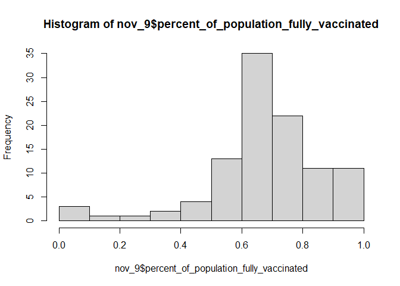
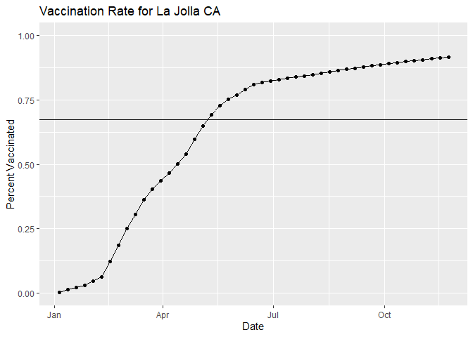
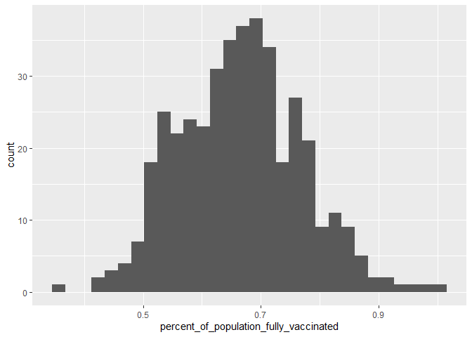
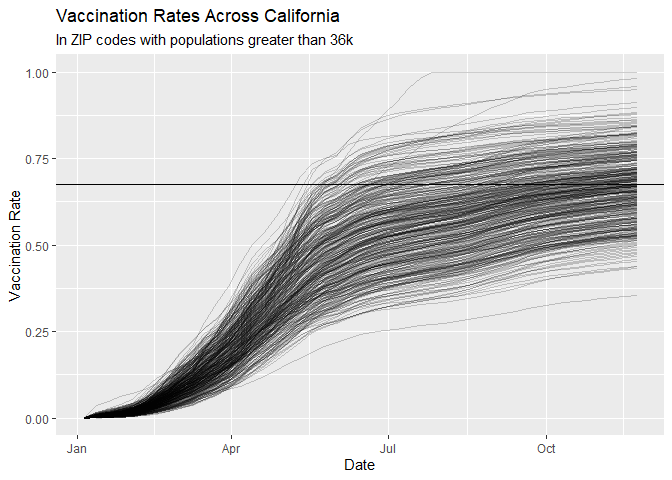

Vaccination Mini Project
================
Claire Chapman
11/28/2021

## Getting Started

Load your data

``` r
vax <- read.csv("covid19vaccinesbyzipcode_test.csv")
head(vax)
```

    ##   as_of_date zip_code_tabulation_area local_health_jurisdiction         county
    ## 1 2021-01-05                    92395            San Bernardino San Bernardino
    ## 2 2021-01-05                    93206                      Kern           Kern
    ## 3 2021-01-05                    91006               Los Angeles    Los Angeles
    ## 4 2021-01-05                    91901                 San Diego      San Diego
    ## 5 2021-01-05                    92230                 Riverside      Riverside
    ## 6 2021-01-05                    92662                    Orange         Orange
    ##   vaccine_equity_metric_quartile                 vem_source
    ## 1                              1 Healthy Places Index Score
    ## 2                              1 Healthy Places Index Score
    ## 3                              3 Healthy Places Index Score
    ## 4                              3 Healthy Places Index Score
    ## 5                              1 Healthy Places Index Score
    ## 6                              4 Healthy Places Index Score
    ##   age12_plus_population age5_plus_population persons_fully_vaccinated
    ## 1               35915.3                40888                       NA
    ## 2                1237.5                 1521                       NA
    ## 3               28742.7                31347                       19
    ## 4               15549.8                16905                       12
    ## 5                2320.2                 2526                       NA
    ## 6                2349.5                 2397                       NA
    ##   persons_partially_vaccinated percent_of_population_fully_vaccinated
    ## 1                           NA                                     NA
    ## 2                           NA                                     NA
    ## 3                          873                               0.000606
    ## 4                          271                               0.000710
    ## 5                           NA                                     NA
    ## 6                           NA                                     NA
    ##   percent_of_population_partially_vaccinated
    ## 1                                         NA
    ## 2                                         NA
    ## 3                                   0.027850
    ## 4                                   0.016031
    ## 5                                         NA
    ## 6                                         NA
    ##   percent_of_population_with_1_plus_dose
    ## 1                                     NA
    ## 2                                     NA
    ## 3                               0.028456
    ## 4                               0.016741
    ## 5                                     NA
    ## 6                                     NA
    ##                                                                redacted
    ## 1 Information redacted in accordance with CA state privacy requirements
    ## 2 Information redacted in accordance with CA state privacy requirements
    ## 3                                                                    No
    ## 4                                                                    No
    ## 5 Information redacted in accordance with CA state privacy requirements
    ## 6 Information redacted in accordance with CA state privacy requirements

> Q1. What column details the total number of people fully vaccinated?

**8**

> Q2. What column details the Zip code tabulation area?

**2**

> Q3. What is the earliest date in this dataset?

**2021-01-05**

> Q4. What is the latest date in this dataset?

**2021-11-23**

``` r
skimr::skim(vax)
```

|                                                  |       |
|:-------------------------------------------------|:------|
| Name                                             | vax   |
| Number of rows                                   | 82908 |
| Number of columns                                | 14    |
| \_\_\_\_\_\_\_\_\_\_\_\_\_\_\_\_\_\_\_\_\_\_\_   |       |
| Column type frequency:                           |       |
| character                                        | 5     |
| numeric                                          | 9     |
| \_\_\_\_\_\_\_\_\_\_\_\_\_\_\_\_\_\_\_\_\_\_\_\_ |       |
| Group variables                                  | None  |

Data summary

**Variable type: character**

| skim\_variable              | n\_missing | complete\_rate | min | max | empty | n\_unique | whitespace |
|:----------------------------|-----------:|---------------:|----:|----:|------:|----------:|-----------:|
| as\_of\_date                |          0 |              1 |  10 |  10 |     0 |        47 |          0 |
| local\_health\_jurisdiction |          0 |              1 |   0 |  15 |   235 |        62 |          0 |
| county                      |          0 |              1 |   0 |  15 |   235 |        59 |          0 |
| vem\_source                 |          0 |              1 |  15 |  26 |     0 |         3 |          0 |
| redacted                    |          0 |              1 |   2 |  69 |     0 |         2 |          0 |

**Variable type: numeric**

| skim\_variable                                 | n\_missing | complete\_rate |     mean |       sd |    p0 |      p25 |      p50 |      p75 |     p100 | hist  |
|:-----------------------------------------------|-----------:|---------------:|---------:|---------:|------:|---------:|---------:|---------:|---------:|:------|
| zip\_code\_tabulation\_area                    |          0 |           1.00 | 93665.11 |  1817.39 | 90001 | 92257.75 | 93658.50 | 95380.50 |  97635.0 | ▃▅▅▇▁ |
| vaccine\_equity\_metric\_quartile              |       4089 |           0.95 |     2.44 |     1.11 |     1 |     1.00 |     2.00 |     3.00 |      4.0 | ▇▇▁▇▇ |
| age12\_plus\_population                        |          0 |           1.00 | 18895.04 | 18993.94 |     0 |  1346.95 | 13685.10 | 31756.12 |  88556.7 | ▇▃▂▁▁ |
| age5\_plus\_population                         |          0 |           1.00 | 20875.24 | 21106.04 |     0 |  1460.50 | 15364.00 | 34877.00 | 101902.0 | ▇▃▂▁▁ |
| persons\_fully\_vaccinated                     |       8355 |           0.90 |  9585.35 | 11609.12 |    11 |   516.00 |  4210.00 | 16095.00 |  71219.0 | ▇▂▁▁▁ |
| persons\_partially\_vaccinated                 |       8355 |           0.90 |  1894.87 |  2105.55 |    11 |   198.00 |  1269.00 |  2880.00 |  20159.0 | ▇▁▁▁▁ |
| percent\_of\_population\_fully\_vaccinated     |       8355 |           0.90 |     0.43 |     0.27 |     0 |     0.20 |     0.44 |     0.63 |      1.0 | ▇▆▇▆▂ |
| percent\_of\_population\_partially\_vaccinated |       8355 |           0.90 |     0.10 |     0.10 |     0 |     0.06 |     0.07 |     0.11 |      1.0 | ▇▁▁▁▁ |
| percent\_of\_population\_with\_1\_plus\_dose   |       8355 |           0.90 |     0.51 |     0.26 |     0 |     0.31 |     0.53 |     0.71 |      1.0 | ▅▅▇▇▃ |

> Q5. How many numeric columns are in this dataset?

**9**

> Q6. Note that there are “missing values” in the dataset. How many NA
> values there in the persons\_fully\_vaccinated column?

**8355**

> Q7. What percent of persons\_fully\_vaccinated values are missing (to
> 2 significant figures)?

**8355/82908 = 10.08%**

> Q8. \[Optional\]: Why might this data be missing?

**Because the CDC was unable to collect the data from the given zip code
due to missing infrastructure or noncompliance**

### Working with dates

``` r
library(lubridate)
```

    ## Warning: package 'lubridate' was built under R version 4.1.2

    ## 
    ## Attaching package: 'lubridate'

    ## The following objects are masked from 'package:base':
    ## 
    ##     date, intersect, setdiff, union

``` r
today()
```

    ## [1] "2021-12-03"

Convert to a format that lubridate will understand

``` r
vax$as_of_date <-  ymd(vax$as_of_date)
```

> Q9. How many days have passed since the last update of the dataset?

``` r
today() - vax$as_of_date[nrow(vax)]
```

    ## Time difference of 10 days

> Q10. How many unique dates are in the dataset (i.e. how many different
> dates are detailed)?

``` r
unique(vax$as_of_date)
```

    ##  [1] "2021-01-05" "2021-01-12" "2021-01-19" "2021-01-26" "2021-02-02"
    ##  [6] "2021-02-09" "2021-02-16" "2021-02-23" "2021-03-02" "2021-03-09"
    ## [11] "2021-03-16" "2021-03-23" "2021-03-30" "2021-04-06" "2021-04-13"
    ## [16] "2021-04-20" "2021-04-27" "2021-05-04" "2021-05-11" "2021-05-18"
    ## [21] "2021-05-25" "2021-06-01" "2021-06-08" "2021-06-15" "2021-06-22"
    ## [26] "2021-06-29" "2021-07-06" "2021-07-13" "2021-07-20" "2021-07-27"
    ## [31] "2021-08-03" "2021-08-10" "2021-08-17" "2021-08-24" "2021-08-31"
    ## [36] "2021-09-07" "2021-09-14" "2021-09-21" "2021-09-28" "2021-10-05"
    ## [41] "2021-10-12" "2021-10-19" "2021-10-26" "2021-11-02" "2021-11-09"
    ## [46] "2021-11-16" "2021-11-23"

**47 unique dates**

### Working with ZIP codes

``` r
library(zipcodeR)
```

    ## Warning: package 'zipcodeR' was built under R version 4.1.2

``` r
geocode_zip('92037')
```

    ## # A tibble: 1 x 3
    ##   zipcode   lat   lng
    ##   <chr>   <dbl> <dbl>
    ## 1 92037    32.8 -117.

Calculate distance between two zip code centers

``` r
zip_distance('92037', '92109')
```

    ##   zipcode_a zipcode_b distance
    ## 1     92037     92109     2.33

Pull census data

``` r
reverse_zipcode(c('92037', "92109"))
```

    ## # A tibble: 2 x 24
    ##   zipcode zipcode_type major_city post_office_city common_city_list county state
    ##   <chr>   <chr>        <chr>      <chr>                      <blob> <chr>  <chr>
    ## 1 92037   Standard     La Jolla   La Jolla, CA           <raw 20 B> San D~ CA   
    ## 2 92109   Standard     San Diego  San Diego, CA          <raw 21 B> San D~ CA   
    ## # ... with 17 more variables: lat <dbl>, lng <dbl>, timezone <chr>,
    ## #   radius_in_miles <dbl>, area_code_list <blob>, population <int>,
    ## #   population_density <dbl>, land_area_in_sqmi <dbl>,
    ## #   water_area_in_sqmi <dbl>, housing_units <int>,
    ## #   occupied_housing_units <int>, median_home_value <int>,
    ## #   median_household_income <int>, bounds_west <dbl>, bounds_east <dbl>,
    ## #   bounds_north <dbl>, bounds_south <dbl>

## Focus on the San Diego area

``` r
library(dplyr)
```

    ## 
    ## Attaching package: 'dplyr'

    ## The following objects are masked from 'package:stats':
    ## 
    ##     filter, lag

    ## The following objects are masked from 'package:base':
    ## 
    ##     intersect, setdiff, setequal, union

``` r
sd <- vax %>% 
  filter(county == "San Diego")
```

> Q11. How many distinct zip codes are listed for San Diego County?

``` r
unique(sd$zip_code_tabulation_area)
```

    ##   [1] 91901 91902 92011 92055 92067 92081 92134 92124 92058 92132 92147 92135
    ##  [13] 92145 92078 92123 92173 92010 92019 92117 91932 92131 91905 92057 91913
    ##  [25] 91942 91910 92009 92026 92140 92029 92102 92155 92014 92061 91934 91916
    ##  [37] 91914 92082 91950 91935 92083 92113 92104 92103 92075 92084 92066 92060
    ##  [49] 91911 91941 91980 92139 92116 91977 92091 92118 91962 91963 91948 92154
    ##  [61] 91906 92120 91978 92114 92115 92122 91917 92064 92126 91931 92069 92086
    ##  [73] 91945 92130 92027 92071 92070 92037 92106 92024 92109 92021 92105 92127
    ##  [85] 92101 92028 92003 92059 92129 92119 92121 92108 92107 92128 92110 92008
    ##  [97] 92007 91915 92004 92020 92111 92065 92025 92036 92054 92056 92040

**107 zip codes in San Diego County**

> Q12. What San Diego County Zip code area has the largest 12 +
> Population in this dataset?

``` r
sd %>% 
  filter(age12_plus_population == max(sd$age12_plus_population))
```

    ##    as_of_date zip_code_tabulation_area local_health_jurisdiction    county
    ## 1  2021-01-05                    92154                 San Diego San Diego
    ## 2  2021-01-12                    92154                 San Diego San Diego
    ## 3  2021-01-19                    92154                 San Diego San Diego
    ## 4  2021-01-26                    92154                 San Diego San Diego
    ## 5  2021-02-02                    92154                 San Diego San Diego
    ## 6  2021-02-09                    92154                 San Diego San Diego
    ## 7  2021-02-16                    92154                 San Diego San Diego
    ## 8  2021-02-23                    92154                 San Diego San Diego
    ## 9  2021-03-02                    92154                 San Diego San Diego
    ## 10 2021-03-09                    92154                 San Diego San Diego
    ## 11 2021-03-16                    92154                 San Diego San Diego
    ## 12 2021-03-23                    92154                 San Diego San Diego
    ## 13 2021-03-30                    92154                 San Diego San Diego
    ## 14 2021-04-06                    92154                 San Diego San Diego
    ## 15 2021-04-13                    92154                 San Diego San Diego
    ## 16 2021-04-20                    92154                 San Diego San Diego
    ## 17 2021-04-27                    92154                 San Diego San Diego
    ## 18 2021-05-04                    92154                 San Diego San Diego
    ## 19 2021-05-11                    92154                 San Diego San Diego
    ## 20 2021-05-18                    92154                 San Diego San Diego
    ## 21 2021-05-25                    92154                 San Diego San Diego
    ## 22 2021-06-01                    92154                 San Diego San Diego
    ## 23 2021-06-08                    92154                 San Diego San Diego
    ## 24 2021-06-15                    92154                 San Diego San Diego
    ## 25 2021-06-22                    92154                 San Diego San Diego
    ## 26 2021-06-29                    92154                 San Diego San Diego
    ## 27 2021-07-06                    92154                 San Diego San Diego
    ## 28 2021-07-13                    92154                 San Diego San Diego
    ## 29 2021-07-20                    92154                 San Diego San Diego
    ## 30 2021-07-27                    92154                 San Diego San Diego
    ## 31 2021-08-03                    92154                 San Diego San Diego
    ## 32 2021-08-10                    92154                 San Diego San Diego
    ## 33 2021-08-17                    92154                 San Diego San Diego
    ## 34 2021-08-24                    92154                 San Diego San Diego
    ## 35 2021-08-31                    92154                 San Diego San Diego
    ## 36 2021-09-07                    92154                 San Diego San Diego
    ## 37 2021-09-14                    92154                 San Diego San Diego
    ## 38 2021-09-21                    92154                 San Diego San Diego
    ## 39 2021-09-28                    92154                 San Diego San Diego
    ## 40 2021-10-05                    92154                 San Diego San Diego
    ## 41 2021-10-12                    92154                 San Diego San Diego
    ## 42 2021-10-19                    92154                 San Diego San Diego
    ## 43 2021-10-26                    92154                 San Diego San Diego
    ## 44 2021-11-02                    92154                 San Diego San Diego
    ## 45 2021-11-09                    92154                 San Diego San Diego
    ## 46 2021-11-16                    92154                 San Diego San Diego
    ## 47 2021-11-23                    92154                 San Diego San Diego
    ##    vaccine_equity_metric_quartile                 vem_source
    ## 1                               2 Healthy Places Index Score
    ## 2                               2 Healthy Places Index Score
    ## 3                               2 Healthy Places Index Score
    ## 4                               2 Healthy Places Index Score
    ## 5                               2 Healthy Places Index Score
    ## 6                               2 Healthy Places Index Score
    ## 7                               2 Healthy Places Index Score
    ## 8                               2 Healthy Places Index Score
    ## 9                               2 Healthy Places Index Score
    ## 10                              2 Healthy Places Index Score
    ## 11                              2 Healthy Places Index Score
    ## 12                              2 Healthy Places Index Score
    ## 13                              2 Healthy Places Index Score
    ## 14                              2 Healthy Places Index Score
    ## 15                              2 Healthy Places Index Score
    ## 16                              2 Healthy Places Index Score
    ## 17                              2 Healthy Places Index Score
    ## 18                              2 Healthy Places Index Score
    ## 19                              2 Healthy Places Index Score
    ## 20                              2 Healthy Places Index Score
    ## 21                              2 Healthy Places Index Score
    ## 22                              2 Healthy Places Index Score
    ## 23                              2 Healthy Places Index Score
    ## 24                              2 Healthy Places Index Score
    ## 25                              2 Healthy Places Index Score
    ## 26                              2 Healthy Places Index Score
    ## 27                              2 Healthy Places Index Score
    ## 28                              2 Healthy Places Index Score
    ## 29                              2 Healthy Places Index Score
    ## 30                              2 Healthy Places Index Score
    ## 31                              2 Healthy Places Index Score
    ## 32                              2 Healthy Places Index Score
    ## 33                              2 Healthy Places Index Score
    ## 34                              2 Healthy Places Index Score
    ## 35                              2 Healthy Places Index Score
    ## 36                              2 Healthy Places Index Score
    ## 37                              2 Healthy Places Index Score
    ## 38                              2 Healthy Places Index Score
    ## 39                              2 Healthy Places Index Score
    ## 40                              2 Healthy Places Index Score
    ## 41                              2 Healthy Places Index Score
    ## 42                              2 Healthy Places Index Score
    ## 43                              2 Healthy Places Index Score
    ## 44                              2 Healthy Places Index Score
    ## 45                              2 Healthy Places Index Score
    ## 46                              2 Healthy Places Index Score
    ## 47                              2 Healthy Places Index Score
    ##    age12_plus_population age5_plus_population persons_fully_vaccinated
    ## 1                76365.2                82971                       33
    ## 2                76365.2                82971                      298
    ## 3                76365.2                82971                      689
    ## 4                76365.2                82971                     1017
    ## 5                76365.2                82971                     1428
    ## 6                76365.2                82971                     2200
    ## 7                76365.2                82971                     3271
    ## 8                76365.2                82971                     4503
    ## 9                76365.2                82971                     7158
    ## 10               76365.2                82971                     9784
    ## 11               76365.2                82971                    12471
    ## 12               76365.2                82971                    14215
    ## 13               76365.2                82971                    16252
    ## 14               76365.2                82971                    18334
    ## 15               76365.2                82971                    20896
    ## 16               76365.2                82971                    23899
    ## 17               76365.2                82971                    27894
    ## 18               76365.2                82971                    31610
    ## 19               76365.2                82971                    35483
    ## 20               76365.2                82971                    38987
    ## 21               76365.2                82971                    42619
    ## 22               76365.2                82971                    44988
    ## 23               76365.2                82971                    47827
    ## 24               76365.2                82971                    50585
    ## 25               76365.2                82971                    52464
    ## 26               76365.2                82971                    54274
    ## 27               76365.2                82971                    55383
    ## 28               76365.2                82971                    56593
    ## 29               76365.2                82971                    57734
    ## 30               76365.2                82971                    58605
    ## 31               76365.2                82971                    59405
    ## 32               76365.2                82971                    60234
    ## 33               76365.2                82971                    61051
    ## 34               76365.2                82971                    61894
    ## 35               76365.2                82971                    62949
    ## 36               76365.2                82971                    63683
    ## 37               76365.2                82971                    64638
    ## 38               76365.2                82971                    65575
    ## 39               76365.2                82971                    66152
    ## 40               76365.2                82971                    66681
    ## 41               76365.2                82971                    67115
    ## 42               76365.2                82971                    67574
    ## 43               76365.2                82971                    68004
    ## 44               76365.2                82971                    68539
    ## 45               76365.2                82971                    69104
    ## 46               76365.2                82971                    69654
    ## 47               76365.2                82971                    70069
    ##    persons_partially_vaccinated percent_of_population_fully_vaccinated
    ## 1                          1341                               0.000398
    ## 2                          1709                               0.003592
    ## 3                          2474                               0.008304
    ## 4                          3956                               0.012257
    ## 5                          6199                               0.017211
    ## 6                          8310                               0.026515
    ## 7                          9021                               0.039423
    ## 8                          9007                               0.054272
    ## 9                          8725                               0.086271
    ## 10                         8440                               0.117921
    ## 11                         8252                               0.150306
    ## 12                         9629                               0.171325
    ## 13                        11344                               0.195876
    ## 14                        13266                               0.220969
    ## 15                        15624                               0.251847
    ## 16                        16283                               0.288040
    ## 17                        16254                               0.336190
    ## 18                        15696                               0.380976
    ## 19                        14312                               0.427655
    ## 20                        13878                               0.469887
    ## 21                        13160                               0.513661
    ## 22                        12421                               0.542214
    ## 23                        11150                               0.576430
    ## 24                         9831                               0.609671
    ## 25                         9473                               0.632317
    ## 26                         9530                               0.654132
    ## 27                         9298                               0.667498
    ## 28                         9085                               0.682082
    ## 29                         8940                               0.695833
    ## 30                         9118                               0.706331
    ## 31                         9475                               0.715973
    ## 32                         9802                               0.725964
    ## 33                         9979                               0.735811
    ## 34                        10099                               0.745971
    ## 35                         9973                               0.758687
    ## 36                         9791                               0.767533
    ## 37                         9589                               0.779043
    ## 38                         9364                               0.790336
    ## 39                         9268                               0.797291
    ## 40                         9291                               0.803666
    ## 41                         9401                               0.808897
    ## 42                         9547                               0.814429
    ## 43                         9782                               0.819612
    ## 44                        10157                               0.826060
    ## 45                        10985                               0.832869
    ## 46                        12812                               0.839498
    ## 47                        14274                               0.844500
    ##    percent_of_population_partially_vaccinated
    ## 1                                    0.016162
    ## 2                                    0.020598
    ## 3                                    0.029818
    ## 4                                    0.047679
    ## 5                                    0.074713
    ## 6                                    0.100155
    ## 7                                    0.108725
    ## 8                                    0.108556
    ## 9                                    0.105157
    ## 10                                   0.101722
    ## 11                                   0.099456
    ## 12                                   0.116053
    ## 13                                   0.136722
    ## 14                                   0.159887
    ## 15                                   0.188307
    ## 16                                   0.196249
    ## 17                                   0.195900
    ## 18                                   0.189175
    ## 19                                   0.172494
    ## 20                                   0.167263
    ## 21                                   0.158610
    ## 22                                   0.149703
    ## 23                                   0.134384
    ## 24                                   0.118487
    ## 25                                   0.114172
    ## 26                                   0.114859
    ## 27                                   0.112063
    ## 28                                   0.109496
    ## 29                                   0.107748
    ## 30                                   0.109894
    ## 31                                   0.114197
    ## 32                                   0.118138
    ## 33                                   0.120271
    ## 34                                   0.121717
    ## 35                                   0.120199
    ## 36                                   0.118005
    ## 37                                   0.115571
    ## 38                                   0.112859
    ## 39                                   0.111702
    ## 40                                   0.111979
    ## 41                                   0.113305
    ## 42                                   0.115064
    ## 43                                   0.117897
    ## 44                                   0.122416
    ## 45                                   0.132396
    ## 46                                   0.154415
    ## 47                                   0.172036
    ##    percent_of_population_with_1_plus_dose redacted
    ## 1                                0.016560       No
    ## 2                                0.024190       No
    ## 3                                0.038122       No
    ## 4                                0.059936       No
    ## 5                                0.091924       No
    ## 6                                0.126670       No
    ## 7                                0.148148       No
    ## 8                                0.162828       No
    ## 9                                0.191428       No
    ## 10                               0.219643       No
    ## 11                               0.249762       No
    ## 12                               0.287378       No
    ## 13                               0.332598       No
    ## 14                               0.380856       No
    ## 15                               0.440154       No
    ## 16                               0.484289       No
    ## 17                               0.532090       No
    ## 18                               0.570151       No
    ## 19                               0.600149       No
    ## 20                               0.637150       No
    ## 21                               0.672271       No
    ## 22                               0.691917       No
    ## 23                               0.710814       No
    ## 24                               0.728158       No
    ## 25                               0.746489       No
    ## 26                               0.768991       No
    ## 27                               0.779561       No
    ## 28                               0.791578       No
    ## 29                               0.803581       No
    ## 30                               0.816225       No
    ## 31                               0.830170       No
    ## 32                               0.844102       No
    ## 33                               0.856082       No
    ## 34                               0.867688       No
    ## 35                               0.878886       No
    ## 36                               0.885538       No
    ## 37                               0.894614       No
    ## 38                               0.903195       No
    ## 39                               0.908993       No
    ## 40                               0.915645       No
    ## 41                               0.922202       No
    ## 42                               0.929493       No
    ## 43                               0.937509       No
    ## 44                               0.948476       No
    ## 45                               0.965265       No
    ## 46                               0.993913       No
    ## 47                               1.000000       No

**92154 zip code has the age 12 plus population of 76365.2**

> Q13. What is the overall average “Percent of Population Fully
> Vaccinated” value for all San Diego “County” as of “2021-11-09”?

``` r
sd %>% 
  filter(as_of_date == "2021-11-09") %>% 
  summarise(avg_fullvax = mean(percent_of_population_fully_vaccinated, na.rm = TRUE))
```

    ##   avg_fullvax
    ## 1   0.6734714

> Q14. Using either ggplot or base R graphics make a summary figure that
> shows the distribution of Percent of Population Fully Vaccinated
> values as of “2021-11-09”?

``` r
library(ggplot2)
```

``` r
nov_9 <- sd %>% 
  filter(as_of_date == "2021-11-09")
hist(nov_9$percent_of_population_fully_vaccinated)
```

<!-- -->

## Focus on UCSD/La Jolla

``` r
ucsd <- filter(sd, zip_code_tabulation_area == "92037")
```

> Q15. Using ggplot make a graph of the vaccination rate time course for
> the 92037 ZIP code area

``` r
ucsd %>% 
  ggplot(aes(x = as_of_date, y = percent_of_population_fully_vaccinated)) +
  geom_point()+
  geom_line(group = 1)+
  ylim(c(0,1)) +
  labs(title = "Vaccination Rate for La Jolla CA", y = "Percent Vaccinated", x = "Date")
```

<!-- --> &gt; Q16.
Calculate the mean “Percent of Population Fully Vaccinated” for ZIP code
areas with a population as large as 92037 (La Jolla) as\_of\_date
“2021-11-16”. Add this as a straight horizontal line to your plot from
above with the geom\_hline() function?

``` r
sd %>% 
  filter(as_of_date == "2021-11-16") %>% 
  filter(age5_plus_population >= 36144) %>% 
  summarise(mean_vaxrate = mean(percent_of_population_fully_vaccinated))
```

    ##   mean_vaxrate
    ## 1    0.6744255

``` r
ucsd %>% 
  ggplot(aes(x = as_of_date, y = percent_of_population_fully_vaccinated)) +
  geom_point()+
  geom_line(group = 1)+
  ylim(c(0,1)) +
  labs(title = "Vaccination Rate for La Jolla CA", y = "Percent Vaccinated", x = "Date")+
  geom_hline(yintercept = 0.6744255)
```

<!-- --> &gt; Q17.
What is the 6 number summary (Min, 1st Qu., Median, Mean, 3rd Qu., and
Max) of the “Percent of Population Fully Vaccinated” values for ZIP code
areas with a population as large as 92037 (La Jolla) as\_of\_date
“2021-11-16”?

``` r
vax %>% 
  filter(as_of_date == "2021-11-16") %>% 
  filter(age5_plus_population >= 36144) %>% 
  summarise(min = min(percent_of_population_fully_vaccinated), median = median(percent_of_population_fully_vaccinated), mean = mean(percent_of_population_fully_vaccinated), sec_qtr = median/2, third_qtr = 3/2*(median),  max = max(percent_of_population_fully_vaccinated))
```

    ##        min   median      mean  sec_qtr third_qtr max
    ## 1 0.352891 0.666522 0.6646457 0.333261  0.999783   1

> Q18. Using ggplot generate a histogram of this data.

``` r
vax %>% 
  filter(as_of_date == "2021-11-16") %>% 
  filter(age5_plus_population >= 36144) %>% 
  ggplot(aes(x = percent_of_population_fully_vaccinated)) +
  geom_histogram()
```

    ## `stat_bin()` using `bins = 30`. Pick better value with `binwidth`.

<!-- -->

> Q19. Is the 92109 and 92040 ZIP code areas above or below the average
> value you calculated for all these above?

``` r
vax %>% filter(as_of_date == "2021-11-16") %>%  
  filter(zip_code_tabulation_area=="92040") %>%
  select(percent_of_population_fully_vaccinated)
```

    ##   percent_of_population_fully_vaccinated
    ## 1                               0.521047

**Lower in ZIP 92040**

``` r
vax %>% filter(as_of_date == "2021-11-16") %>%  
  filter(zip_code_tabulation_area=="92109") %>%
  select(percent_of_population_fully_vaccinated)
```

    ##   percent_of_population_fully_vaccinated
    ## 1                                0.68863

**Greater in ZIP 92109**

> Q20. Finally make a time course plot of vaccination progress for all
> areas in the full dataset with a age5\_plus\_population &gt; 36144

``` r
vax.36 <- vax %>% 
  filter(age5_plus_population > 36144) 
vax.36 %>% 
  ggplot(aes(x = as_of_date,  y = percent_of_population_fully_vaccinated, group = zip_code_tabulation_area)) +
  geom_line(alpha = 0.2)+
  ylim(c(0,1))+
  labs(x = "Date", y = "Vaccination Rate", title = "Vaccination Rates Across California", subtitle = "In ZIP codes with populations greater than 36k")+
  geom_hline(yintercept = 0.6744255)
```

    ## Warning: Removed 176 row(s) containing missing values (geom_path).

<!-- -->
