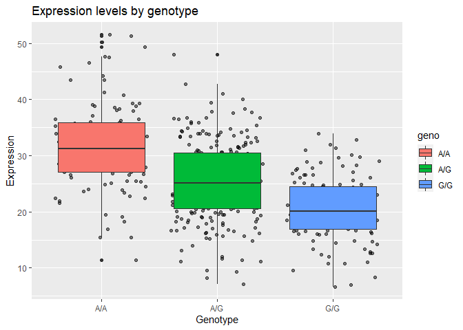

Genome Informatics
================
Claire Chapman
11/26/2021

# Introduction to Genome Informatics Lab

## Section 1: Identify genetic variants of interest

> Q1: What are those 4 candidate SNPs?

**According to Verlaan et al. (2009), the four SNPs were rs12936231,
rs8067378, rs9303277, and rs7216389**

> Q2: What three genes do these variants overlap or effect?

**According to ENSEMBL, the three genes effected by these variants are
GSDMB, IKZF3, and ZPBP2.**

> Q3: What is the location of rs8067378 and what are the different
> alleles for rs8067378?

**The location is 17:39,894,595-39,895,595 and it has A/C/G alleles**

> Q4: Name at least 3 downstream genes for rs8067378?

**LRRC3C, PSMD3, and CSF3**

> Q5: What proportion of the Mexican Ancestry in Los Angeles sample
> population (MXL) are homozygous for the asthma associated SNP (G\|G)?

**9**

> Q6. Back on the ENSEMBLE page, use the “search for a sample” field
> above to find the particular sample HG00109. This is a male from the
> GBR population group. What is the genotype for this sample?

**G\|G**

## Section 2: Initial RNA-Seq Analysis

> Q7: How many sequences are there in the first file? What is the file
> size and format of the data?

**3863 sequences in the first file. It is a 758 KB FASTQ file**

> Q8: What is the GC content and sequence length of the second fastq
> file?

**54% GC and sequence length of 50-75**

> Q9: How about per base sequence quality? Does any base have a mean
> quality score below 20?

**No bases in the second sequence had a quality score below 20**

## Section 3: Mapping RNA-Seq reads to genome

We are going to use the Tophat tool Returns five outputs:
accepted\_hits, insertions, deletions, splice junctions, and alignment
summary

### Accepted Hits

> Q10: Where are most the accepted hits located?

**chr17:38,150,000-38,155,000**

> Q11: Following Q10, is there any interesting gene around that area?

**Human Gene PSMD3: 26s proteasome non-ATPase regulatory subunit3**

### Cufflinks

We will use this tool to calculate gene expression Returns multiple
outputs, we will look at the **Gene Expression** output

> Q13: Read this file into R and determine the sample size for each
> genotype and their corresponding median expression levels for each of
> these genotypes.

``` r
url <- "https://bioboot.github.io/bggn213_F21/class-material/rs8067378_ENSG00000172057.6.txt"
data <- read.table(url)
head(data)
```

    ##    sample geno      exp
    ## 1 HG00367  A/G 28.96038
    ## 2 NA20768  A/G 20.24449
    ## 3 HG00361  A/A 31.32628
    ## 4 HG00135  A/A 34.11169
    ## 5 NA18870  G/G 18.25141
    ## 6 NA11993  A/A 32.89721

``` r
library(dplyr)
```

    ## 
    ## Attaching package: 'dplyr'

    ## The following objects are masked from 'package:stats':
    ## 
    ##     filter, lag

    ## The following objects are masked from 'package:base':
    ## 
    ##     intersect, setdiff, setequal, union

``` r
library(ggplot2)
```

``` r
data %>% 
  group_by(geno) %>% 
  summarise(sample_size = n(), median = median(exp))
```

    ## # A tibble: 3 x 3
    ##   geno  sample_size median
    ##   <chr>       <int>  <dbl>
    ## 1 A/A           108   31.2
    ## 2 A/G           233   25.1
    ## 3 G/G           121   20.1

> Q14: Generate a boxplot with a box per genotype, what could you infer
> from the relative expression value between A/A and G/G displayed in
> this plot? Does the SNP effect the expression of ORMDL3?

``` r
data %>% 
  group_by(geno) %>% 
  ggplot(aes(geno, exp, fill = geno)) +
   geom_jitter(alpha = 0.5)+
  geom_boxplot()+
  labs(title = "Expression levels by genotype", x = "Genotype", y = "Expression")
```

<!-- -->

**Since there is a difference in expression between the A/A and G/G
genotype, we can hypothesize that the SNP does affect the experssion of
ORMDL3.**
