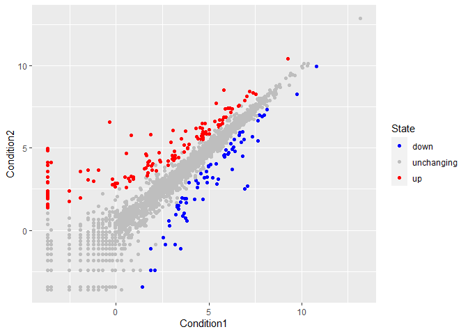

Data Visualization
================
Claire Chapman
2021-12-03

``` r
## ggplot Intro
# only have to install package once but have to use library every time
library(ggplot2)
# could also use "base" R graphics plot(). Good for quick exploration but not as beautiful for presentations

head(cars)
```

    ##   speed dist
    ## 1     4    2
    ## 2     4   10
    ## 3     7    4
    ## 4     7   22
    ## 5     8   16
    ## 6     9   10

``` r
ggplot(cars)
```

<!-- -->

``` r
# first layer: dataset specified

ggplot(cars) + 
  aes(x=speed, y=dist)
```

<!-- -->

``` r
#second layer: mapped variables from dataset to axes but no data yet

ggplot(cars) + 
  aes(x=speed, y=dist) + 
  geom_point()
```

<!-- -->

``` r
#third layer: finally geometry specified and graph can be made


#adding a trend line with geom_smooth
ggplot(cars) + 
  aes(x=speed, y=dist) + 
  geom_point()+
  geom_smooth()
```

    ## `geom_smooth()` using method = 'loess' and formula 'y ~ x'

<!-- -->

``` r
#adding more labels and changing the theme
ggplot(cars) + 
  aes(x = speed, y = dist) + 
  geom_point()+
  geom_smooth()+
  labs(title = "Stopping Distances of Old Cars", x = "Speed (MPH)", y = "Stopping Distance (ft)")+
  theme_bw()
```

    ## `geom_smooth()` using method = 'loess' and formula 'y ~ x'

<!-- -->

``` r
#argue to make linear model
ggplot(cars) + 
  aes(x = speed, y = dist) + 
  geom_point()+
  geom_smooth(method = "lm")+
  labs(title = "Stopping Distances of Old Cars", x = "Speed (MPH)", y = "Stopping Distance (ft)")+
  theme_bw()
```

    ## `geom_smooth()` using formula 'y ~ x'

<!-- -->

``` r
##more aesthetics
#first load and explore the new data
url <- "https://bioboot.github.io/bimm143_S20/class-material/up_down_expression.txt"
genes <- read.delim(url)
head(genes)
```

    ##         Gene Condition1 Condition2      State
    ## 1      A4GNT -3.6808610 -3.4401355 unchanging
    ## 2       AAAS  4.5479580  4.3864126 unchanging
    ## 3      AASDH  3.7190695  3.4787276 unchanging
    ## 4       AATF  5.0784720  5.0151916 unchanging
    ## 5       AATK  0.4711421  0.5598642 unchanging
    ## 6 AB015752.4 -3.6808610 -3.5921390 unchanging

``` r
nrow(genes)
```

    ## [1] 5196

``` r
colnames(genes)
```

    ## [1] "Gene"       "Condition1" "Condition2" "State"

``` r
ncol(genes)
```

    ## [1] 4

``` r
table(genes$State)
```

    ## 
    ##       down unchanging         up 
    ##         72       4997        127

``` r
total_upreg <- round(table(genes$State)/nrow(genes)*100, 2)
total_upreg
```

    ## 
    ##       down unchanging         up 
    ##       1.39      96.17       2.44

``` r
#scatter plot
ggplot(genes)+
  aes(x = Condition1, y = Condition2)+
  geom_point()
```

<!-- -->

``` r
p <- ggplot(genes)+
  aes(x = Condition1, y = Condition2, col = State)+
  geom_point()

p + scale_color_manual(values = c("blue","grey", "red"))
```

<!-- -->

``` r
# adding plot annotations
p + scale_color_manual(values = c("blue","grey", "red")) + 
  labs(title = "Gene Expression Changes Upon Drug Treatment", x = "Control (No Drug)", y = "Drug Treatment")
```

<!-- -->

``` r
### Optional Going Further
# install.packages("gapminder")
library(gapminder)
# install.packages("dplyr")
library(dplyr)
```

    ## 
    ## Attaching package: 'dplyr'

    ## The following objects are masked from 'package:stats':
    ## 
    ##     filter, lag

    ## The following objects are masked from 'package:base':
    ## 
    ##     intersect, setdiff, setequal, union

``` r
colnames(gapminder)
```

    ## [1] "country"   "continent" "year"      "lifeExp"   "pop"       "gdpPercap"

``` r
# playing around with gapminder
ggplot(gapminder) +
  aes(x = year, y = lifeExp, col = continent)+
  geom_jitter(width = 0.3, alpha = 0.4) +
  geom_violin(aes(group = year), alpha = 0.2)
```

<!-- -->

``` r
# Using ggplotly to make any ggplot interactive!
#install.packages("plotly")
#library(plotly)
#ggplotly()

## looking at 2007
gapminder_2007 <- gapminder %>% 
  filter(year == 2007)

ggplot(gapminder_2007) +
  aes(x = gdpPercap, y = lifeExp) +
  geom_point()
```

<!-- -->

``` r
# to help see all the points, change transparency
ggplot(gapminder_2007) +
  aes(x = gdpPercap, y = lifeExp) +
  geom_point(alpha = 0.5)
```

<!-- -->

``` r
# more aesthetics
ggplot(gapminder_2007) +
  aes(x = gdpPercap, y = lifeExp, color = continent, size = pop) +
  geom_point(alpha = 0.5)
```

<!-- -->

``` r
ggplot(gapminder_2007) +
  aes(x = gdpPercap, y = lifeExp, color = pop) +
  geom_point(alpha = 0.8)
```

<!-- -->

``` r
ggplot(gapminder_2007) +
  geom_point(aes(x = gdpPercap, y = lifeExp, size = pop), alpha = 0.5) +
  scale_size_area(max_size = 10)
```

<!-- -->

``` r
# looking at 1957
gapminder_1957 <- gapminder %>% 
  filter(year == 1957)

ggplot(gapminder_2007) +
  geom_point(aes(x = gdpPercap, y = lifeExp, color = continent, size = pop), alpha = 0.7) +
  scale_size_area(max_size = 15)
```

<!-- -->

``` r
# comparing 2007 and 1957
gapminder_1957_2007 <- gapminder %>% 
  filter(year == 1957 | year == 2007)

ggplot(gapminder_1957_2007)+
  geom_point(aes(x = gdpPercap, y = lifeExp, color = continent, size = pop), alpha = 0.7) +
  scale_size_area(max_size = 15)+
  facet_wrap(~year)
```

<!-- -->

``` r
### Optional Bar Charts
gapminder_top5 <- gapminder %>% 
  filter(year == 2007) %>% 
  arrange(desc(pop)) %>% 
  top_n(5, pop)

gapminder_top5
```

    ## # A tibble: 5 x 6
    ##   country       continent  year lifeExp        pop gdpPercap
    ##   <fct>         <fct>     <int>   <dbl>      <int>     <dbl>
    ## 1 China         Asia       2007    73.0 1318683096     4959.
    ## 2 India         Asia       2007    64.7 1110396331     2452.
    ## 3 United States Americas   2007    78.2  301139947    42952.
    ## 4 Indonesia     Asia       2007    70.6  223547000     3541.
    ## 5 Brazil        Americas   2007    72.4  190010647     9066.

``` r
## Geom_col
ggplot(gapminder_top5)+
  geom_col(aes(x = country, y = pop))
```

<!-- -->

``` r
# countries in alphabetical order by default

ggplot(gapminder_top5)+
  geom_col(aes(x = country, y = lifeExp))
```

<!-- -->

``` r
# adding color to categorical variable - discrete colors for each bar
ggplot(gapminder_top5)+
  geom_col(aes(x = country, y = pop, fill = continent))
```

<!-- -->

``` r
# adding color to continuous variable - gradient of colors
ggplot(gapminder_top5)+
  geom_col(aes(x = country, y = pop, fill = lifeExp))
```

<!-- -->

``` r
ggplot(gapminder_top5)+
  geom_col(aes(x = country, y = pop, fill = gdpPercap))
```

<!-- -->

``` r
# to change the order of the bars, use reorder() in x aesthetic. First argument is the x variable, second argument is how you want it ordered (negative sign is in descending order)
ggplot(gapminder_top5)+
  aes(x = reorder(country, -pop), y = pop, fill = gdpPercap)+
  geom_col()
```

<!-- -->

``` r
# col is outline, fill is whole bar. guides(fill = "none") gets rid of legend
ggplot(gapminder_top5)+
  aes(x = reorder(country, -pop), y = pop, fill = country)+
  geom_col(col = "black") +
  guides(fill = "none")
```

<!-- -->

``` r
## Flipping Bar Charts
head(USArrests)
```

    ##            Murder Assault UrbanPop Rape
    ## Alabama      13.2     236       58 21.2
    ## Alaska       10.0     263       48 44.5
    ## Arizona       8.1     294       80 31.0
    ## Arkansas      8.8     190       50 19.5
    ## California    9.0     276       91 40.6
    ## Colorado      7.9     204       78 38.7

``` r
# adding a States column
USArrests$State <- rownames(USArrests)
head(USArrests)
```

    ##            Murder Assault UrbanPop Rape      State
    ## Alabama      13.2     236       58 21.2    Alabama
    ## Alaska       10.0     263       48 44.5     Alaska
    ## Arizona       8.1     294       80 31.0    Arizona
    ## Arkansas      8.8     190       50 19.5   Arkansas
    ## California    9.0     276       91 40.6 California
    ## Colorado      7.9     204       78 38.7   Colorado

``` r
# using reorder to arrange by murders in each state, using coord_flip() to have a horizontal bar chart
ggplot(USArrests) +
  aes(x = reorder(State, Murder), y = Murder) +
  geom_col() +
  coord_flip()
```

<!-- -->

``` r
# adding geom_segment() with geom_point() to improve visualization
# arguments for geom_segment() include start and end point for x and y
ggplot(USArrests) +
  aes(x = reorder(State, Murder), y = Murder) +
  geom_point() +
  geom_segment(aes(x = State, xend = State, y = 0, yend = Murder), color = "orange")+
  coord_flip()
```

<!-- -->

``` r
### Animation!
# install.packages("gifski")
# install.packages("gganimate")
library(gganimate)

## regular ggplot of gapminder, per capita vs life expectancy, size by populationi, colored by coutry, and faceted by continent
# had to get rid of legend because too many countries
ggplot(gapminder)+
  aes(x = gdpPercap, y = lifeExp, size = pop, color = country)+
  geom_point(alpha = 0.5, show.legend = FALSE)+
  facet_wrap(~continent)
```

<!-- -->

``` r
# scale_color_manual by country colors makes each country a gradient of color
ggplot(gapminder)+
  aes(x = gdpPercap, y = lifeExp, size = pop, color = country)+
  geom_point(alpha = 0.5, show.legend = FALSE)+
  scale_color_manual(values = country_colors)+
  facet_wrap(~continent)
```

<!-- -->

``` r
## Animation time, have to comment out before printing to pdf
# ggplot(gapminder)+
  #aes(x = gdpPercap, y = lifeExp, size = pop, color = country)+
  #geom_point(alpha = 0.5, show.legend = FALSE)+
  #scale_color_manual(values = country_colors)+
  #facet_wrap(~continent)+
  #labs(title = 'Year: {frame_time}', x = 'GDP per capita', y = 'life expectancy') +
  #transition_time(year) +
  #shadow_wake(wake_length = 0.1, alpha = FALSE)
```
