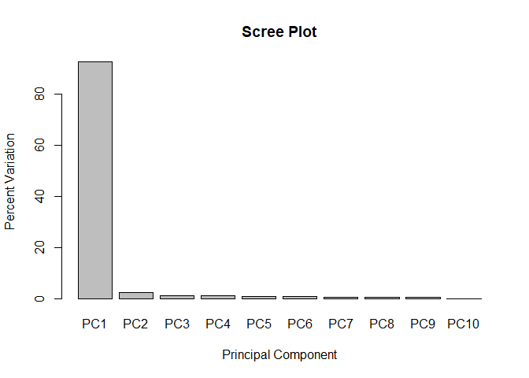

Introduction to Machine Learning
================
Claire Chapman
10/24/2021

# Clustering methods

## kmeans()

### First lets make up some data to cluster

``` r
tmp <- c(rnorm(30, 3), rnorm(30, -3))
tmp
```

    ##  [1]  1.949560  1.460269  2.768631  2.344374  4.399573  2.984136  2.499409
    ##  [8]  3.312604  2.889832  3.431078  2.870798  3.887501  4.848608  3.826422
    ## [15]  1.858206  1.389532  2.712091  3.009193  2.824275  3.111927  1.793882
    ## [22]  4.183873  2.638974  2.953295  3.475109  1.758898  3.993497  2.212229
    ## [29]  2.441072  3.212870 -1.750406 -3.132077 -2.333050 -3.327196 -3.733617
    ## [36] -1.842713 -2.437303 -2.101052 -3.558562 -5.265273 -2.568985 -3.840778
    ## [43] -3.648931 -5.003412 -2.608686 -1.980908 -2.126052 -3.666457 -2.374606
    ## [50] -1.120921 -2.709855 -1.097299 -0.650693 -2.213895 -3.948098 -1.764697
    ## [57] -2.526939 -2.662185 -2.884113 -3.545710

``` r
data <- cbind(x = tmp, y = rev(tmp))
data
```

    ##               x         y
    ##  [1,]  1.949560 -3.545710
    ##  [2,]  1.460269 -2.884113
    ##  [3,]  2.768631 -2.662185
    ##  [4,]  2.344374 -2.526939
    ##  [5,]  4.399573 -1.764697
    ##  [6,]  2.984136 -3.948098
    ##  [7,]  2.499409 -2.213895
    ##  [8,]  3.312604 -0.650693
    ##  [9,]  2.889832 -1.097299
    ## [10,]  3.431078 -2.709855
    ## [11,]  2.870798 -1.120921
    ## [12,]  3.887501 -2.374606
    ## [13,]  4.848608 -3.666457
    ## [14,]  3.826422 -2.126052
    ## [15,]  1.858206 -1.980908
    ## [16,]  1.389532 -2.608686
    ## [17,]  2.712091 -5.003412
    ## [18,]  3.009193 -3.648931
    ## [19,]  2.824275 -3.840778
    ## [20,]  3.111927 -2.568985
    ## [21,]  1.793882 -5.265273
    ## [22,]  4.183873 -3.558562
    ## [23,]  2.638974 -2.101052
    ## [24,]  2.953295 -2.437303
    ## [25,]  3.475109 -1.842713
    ## [26,]  1.758898 -3.733617
    ## [27,]  3.993497 -3.327196
    ## [28,]  2.212229 -2.333050
    ## [29,]  2.441072 -3.132077
    ## [30,]  3.212870 -1.750406
    ## [31,] -1.750406  3.212870
    ## [32,] -3.132077  2.441072
    ## [33,] -2.333050  2.212229
    ## [34,] -3.327196  3.993497
    ## [35,] -3.733617  1.758898
    ## [36,] -1.842713  3.475109
    ## [37,] -2.437303  2.953295
    ## [38,] -2.101052  2.638974
    ## [39,] -3.558562  4.183873
    ## [40,] -5.265273  1.793882
    ## [41,] -2.568985  3.111927
    ## [42,] -3.840778  2.824275
    ## [43,] -3.648931  3.009193
    ## [44,] -5.003412  2.712091
    ## [45,] -2.608686  1.389532
    ## [46,] -1.980908  1.858206
    ## [47,] -2.126052  3.826422
    ## [48,] -3.666457  4.848608
    ## [49,] -2.374606  3.887501
    ## [50,] -1.120921  2.870798
    ## [51,] -2.709855  3.431078
    ## [52,] -1.097299  2.889832
    ## [53,] -0.650693  3.312604
    ## [54,] -2.213895  2.499409
    ## [55,] -3.948098  2.984136
    ## [56,] -1.764697  4.399573
    ## [57,] -2.526939  2.344374
    ## [58,] -2.662185  2.768631
    ## [59,] -2.884113  1.460269
    ## [60,] -3.545710  1.949560

Using just our eyes, we can assume that we should get two clusters

``` r
plot(data)
```

<!-- --> \#\#\# Run
kmeans() The argument **k** tells how many clusters you are asking for.
The argument **nstarts** tells how many iterations

``` r
km <- kmeans(data, centers = 2, nstart = 20)
km
```

    ## K-means clustering with 2 clusters of sizes 30, 30
    ## 
    ## Cluster means:
    ##           x         y
    ## 1  2.901391 -2.747482
    ## 2 -2.747482  2.901391
    ## 
    ## Clustering vector:
    ##  [1] 1 1 1 1 1 1 1 1 1 1 1 1 1 1 1 1 1 1 1 1 1 1 1 1 1 1 1 1 1 1 2 2 2 2 2 2 2 2
    ## [39] 2 2 2 2 2 2 2 2 2 2 2 2 2 2 2 2 2 2 2 2 2 2
    ## 
    ## Within cluster sum of squares by cluster:
    ## [1] 55.04808 55.04808
    ##  (between_SS / total_SS =  89.7 %)
    ## 
    ## Available components:
    ## 
    ## [1] "cluster"      "centers"      "totss"        "withinss"     "tot.withinss"
    ## [6] "betweenss"    "size"         "iter"         "ifault"

> Q1. How many points are in each cluster?

``` r
km$size
```

    ## [1] 30 30

**Thirty points in each cluster**

> Q2. What “component” of your result object details cluster
> assignment/membership?

``` r
km$cluster
```

    ##  [1] 1 1 1 1 1 1 1 1 1 1 1 1 1 1 1 1 1 1 1 1 1 1 1 1 1 1 1 1 1 1 2 2 2 2 2 2 2 2
    ## [39] 2 2 2 2 2 2 2 2 2 2 2 2 2 2 2 2 2 2 2 2 2 2

> Q3. What “component” of your result object details cluster center?

``` r
km$centers
```

    ##           x         y
    ## 1  2.901391 -2.747482
    ## 2 -2.747482  2.901391

> Q4. Plot x colored by the kmeans cluster assignment and add cluster
> centers as blue points

``` r
plot(data, col = km$cluster)
points(km$centers, col = "blue", pch = 15)
```

<!-- -->

## Hierarchical Clustering, **hclust()**

A little bit more work required than in kmeans: can’t just use x, need a
distance matrix using function **dist()**

``` r
hc <- hclust(dist(data))
hc
```

    ## 
    ## Call:
    ## hclust(d = dist(data))
    ## 
    ## Cluster method   : complete 
    ## Distance         : euclidean 
    ## Number of objects: 60

This printout wasn’t very helpful, use a plot. Hclust() has its own
useful plot method

``` r
plot(hc)
abline(h = 7, col = "red")
```

<!-- -->

To find out membership vector, we need to “cut” the tree. Use
**cutree()** function and tell it the height to cut at

``` r
cutree(hc, h = 7)
```

    ##  [1] 1 1 1 1 1 1 1 1 1 1 1 1 1 1 1 1 1 1 1 1 1 1 1 1 1 1 1 1 1 1 2 2 2 2 2 2 2 2
    ## [39] 2 2 2 2 2 2 2 2 2 2 2 2 2 2 2 2 2 2 2 2 2 2

Can also use **cutree()** and state the number of k clusters we want

``` r
grps <- cutree(hc, k = 2)
grps
```

    ##  [1] 1 1 1 1 1 1 1 1 1 1 1 1 1 1 1 1 1 1 1 1 1 1 1 1 1 1 1 1 1 1 2 2 2 2 2 2 2 2
    ## [39] 2 2 2 2 2 2 2 2 2 2 2 2 2 2 2 2 2 2 2 2 2 2

``` r
plot(data, col = grps)
```

<!-- -->

# Principal Component Analysis (PCA)

A useful analysis method when you have lots of dimensions in your data

## PCA of UK food data

### Read in data

``` r
url <- "https://tinyurl.com/UK-foods"
x <- read.csv(url)
```

> Q5. How many rows and columns are in your new data frame named x? What
> R functions could you use to answer this questions?

``` r
dim(x)
```

    ## [1] 17  5

Why aren’t there only 4 columns (one for each country)?

``` r
head(x)
```

    ##                X England Wales Scotland N.Ireland
    ## 1         Cheese     105   103      103        66
    ## 2  Carcass_meat      245   227      242       267
    ## 3    Other_meat      685   803      750       586
    ## 4           Fish     147   160      122        93
    ## 5 Fats_and_oils      193   235      184       209
    ## 6         Sugars     156   175      147       139

Row names were being assigned to the first column, incorrectly

### Fix data

``` r
rownames(x) <- x[,1]
x <- x[,-1]
head(x)
```

    ##                England Wales Scotland N.Ireland
    ## Cheese             105   103      103        66
    ## Carcass_meat       245   227      242       267
    ## Other_meat         685   803      750       586
    ## Fish               147   160      122        93
    ## Fats_and_oils      193   235      184       209
    ## Sugars             156   175      147       139

The better way to fix this is upon import

``` r
x <- read.csv(url, row.names = 1)
dim(x)
```

    ## [1] 17  4

> Q6. Which approach to solving the ‘row-names problem’ mentioned above
> do you prefer and why? Is one approach more robust than another under
> certain circumstances?

The second method is much better because it makes the correct change,
permanently, to the dataset whereas the first method will keep taking
away the first column.

### Plotting the data

``` r
barplot(as.matrix(x), beside = T, col = rainbow(nrow(x)))
```

<!-- -->

> Q7: Changing what optional argument in the above barplot() function
> results in the following plot?

The argument “beside” determines if values are stacked on top of each
other or beside each other. Default is beside = F and values are stacked

> Q8: Generating all pairwise plots may help somewhat. Can you make
> sense of the following code and resulting figure? What does it mean if
> a given point lies on the diagonal for a given plot?

``` r
mycols <- rainbow(nrow(x))
pairs(x, col=mycols, pch=16)
```

<!-- --> This plot
compares all pairs of countries. Points on the diagonal show that tha
data is the same for the pair of countries. Points that are not on the
diagonal signify differences between the two countries being compared.

> Q9. What is the main differences between N. Ireland and the other
> countries of the UK in terms of this data-set?

The main difference between N. Ireland and the other countries is the
green data point that was consumed at a higher quantity in N.Ireland
than others. The results are still just qualitative though…

## PCA is here to help

Base R function **prcomp()** to find PCA First need to tranpose the
data, this function wants countries in rows and foods in columns

``` r
pca <- prcomp(t(x))
summary(pca)
```

    ## Importance of components:
    ##                             PC1      PC2      PC3       PC4
    ## Standard deviation     324.1502 212.7478 73.87622 4.189e-14
    ## Proportion of Variance   0.6744   0.2905  0.03503 0.000e+00
    ## Cumulative Proportion    0.6744   0.9650  1.00000 1.000e+00

``` r
plot(pca)
```

<!-- -->

We want the **score plot** (aka PCA plot), the plot of PC1 vs. PC2 that
we often see

``` r
attributes(pca)
```

    ## $names
    ## [1] "sdev"     "rotation" "center"   "scale"    "x"       
    ## 
    ## $class
    ## [1] "prcomp"

We want pca$x component for this plot

``` r
plot(pca$x[,1:2])
text(pca$x[,1:2], labels = colnames(x))
```

<!-- -->

### PCA “loadings”

Loadings tell us how much each variable contributes to each PC

``` r
par(mar = c(10, 3, 0.35, 0))
barplot(pca$rotation[,1], las = 2)
```

<!-- -->

## One more PCA for the day

``` r
url2 <- "https://tinyurl.com/expression-CSV"
rna.data <- read.csv(url2, row.names=1)
head(rna.data)
```

    ##        wt1 wt2  wt3  wt4 wt5 ko1 ko2 ko3 ko4 ko5
    ## gene1  439 458  408  429 420  90  88  86  90  93
    ## gene2  219 200  204  210 187 427 423 434 433 426
    ## gene3 1006 989 1030 1017 973 252 237 238 226 210
    ## gene4  783 792  829  856 760 849 856 835 885 894
    ## gene5  181 249  204  244 225 277 305 272 270 279
    ## gene6  460 502  491  491 493 612 594 577 618 638

> Q10 How many genes and samples are in the data set?

``` r
nrow(rna.data)
```

    ## [1] 100

100 genes

``` r
ncol(rna.data)
```

    ## [1] 10

``` r
colnames(rna.data)
```

    ##  [1] "wt1" "wt2" "wt3" "wt4" "wt5" "ko1" "ko2" "ko3" "ko4" "ko5"

10 samples

### PCA

The argument scale normalizes the ranges in observations

``` r
pca.rna <- prcomp(t(rna.data), scale = T)
summary(pca.rna)
```

    ## Importance of components:
    ##                           PC1    PC2     PC3     PC4     PC5     PC6     PC7
    ## Standard deviation     9.6237 1.5198 1.05787 1.05203 0.88062 0.82545 0.80111
    ## Proportion of Variance 0.9262 0.0231 0.01119 0.01107 0.00775 0.00681 0.00642
    ## Cumulative Proportion  0.9262 0.9493 0.96045 0.97152 0.97928 0.98609 0.99251
    ##                            PC8     PC9      PC10
    ## Standard deviation     0.62065 0.60342 3.348e-15
    ## Proportion of Variance 0.00385 0.00364 0.000e+00
    ## Cumulative Proportion  0.99636 1.00000 1.000e+00

``` r
plot(pca.rna)
```

<!-- -->

``` r
plot(pca.rna$x[,1:2])
text(pca.rna$x[,1:2], labels = colnames(rna.data))
```

<!-- -->

### Quick scree plot

``` r
plot(pca, main = "Quick scree plot")
```

<!-- -->

### our own scree plots

Variance captured per PC

``` r
pca.var <- pca.rna$sdev^2
```

Percent variance is often more informative to look at

``` r
pca.var.per <- round(pca.var/sum(pca.var)*100, 1)
pca.var.per
```

    ##  [1] 92.6  2.3  1.1  1.1  0.8  0.7  0.6  0.4  0.4  0.0

``` r
barplot(pca.var.per, main="Scree Plot", 
        names.arg = paste0("PC", 1:10),
        xlab="Principal Component", ylab="Percent Variation")
```

<!-- -->

Adding colors

``` r
colvec <- colnames(rna.data)
colvec[grep("wt", colvec)] <- "red"
colvec[grep("ko", colvec)] <- "blue"

plot(pca$x[,1], pca$x[,2], col=colvec, pch=16,
     xlab=paste0("PC1 (", pca.var.per[1], "%)"),
     ylab=paste0("PC2 (", pca.var.per[2], "%)"))

text(pca$x[,1], pca$x[,2], labels = colnames(rna.data), pos=c(rep(4,5), rep(2,5)))
```

<!-- -->
