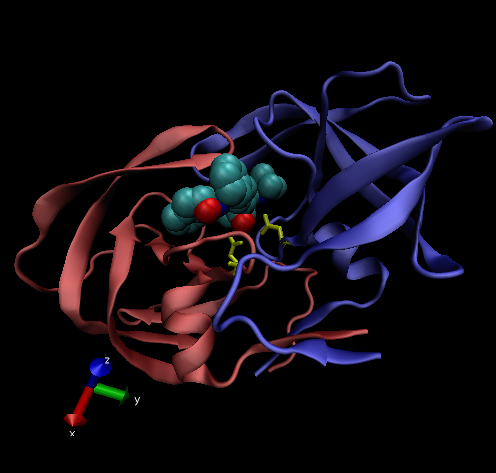

# Introduction to the RCSB Protein Data Bank (PDB)
## PDB Statistics

Importing CSV
```{r}
pdb_csv <- read.csv("Data Export Summary.csv", row.names = 1)
head(pdb_csv)
```

> Q1: What percentage of structures in the PDB are solved by X-Ray and Electron Microscopy.

Percentage using X-ray
```{r}
perc_xray <- (sum(pdb_csv$X.ray)/sum(pdb_csv$Total))*100
perc_xray
```
Percentage using EM
```{r}
perc_em <- (sum(pdb_csv$EM)/sum(pdb_csv$Total))*100
perc_em
```


> Q2: What proportion of structures in the PDB are protein?

```{r}
perc_protein <- (pdb_csv[1,7]/sum(pdb_csv$Total))*100
perc_protein
```

> Q3: Type HIV in the PDB website search box on the home page and determine how many HIV-1 protease structures are in the current PDB?

**I found 1205 HIV-1 Proteases in my search**

## The PDB Format
Importing specific PDB File for HIV-1 into VMD

> Q4: Water molecules normally have 3 atoms. Why do we see just one atom per water molecule in this structure?

**The EM resolution is 2 angstroms which is not fine enough to see the hydrogen atoms**

> Q5: There is a conserved water molecule in the binding site. Can you identify this water molecule? What residue number does this water molecule have (see note below)?

**The water molecule with residue number 308 is in the binding site, best seen when the drug is in the binding site.**

### Import image into R



# Using Bio3D in R for Structural Bioinformatics

```{r}
library("bio3d")

pdb <- read.pdb("1hel")
pdb
```
```{r}
pdb$atom
```
Normal Mode Analysis (nma) is a prediction of the conformational variability and intrinsic dynamics of this protein
```{r}
m <- nma(pdb)
plot(m)
```
Saving the file to make a movie
```{r}
mktrj(m, file = "nma.pdb")
```

Can open in VMD. There will be 34 frames, can press play to watch
