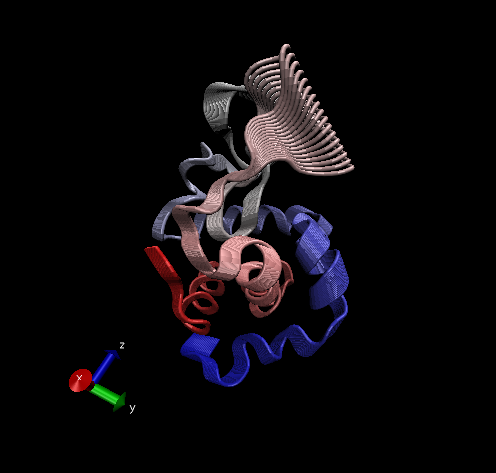

# Working with bio3d

```{r}
library(bio3d)
pdb <- read.pdb("1hel")
pdb
```

> Q7: How many amino acid residues are there in this pdb object?

**129 amino acids**

> Q8: Name one of the two non-protein residues?

**A non-protein residue example is water**

> Q9: How many protein chains are in this structure?

**There is 1 chain**

```{r}
head(pdb$atom)
```

Let's do a quick bioinformatics prediction of protein dynamics (flexibility). We use the **nma()** function, which does **normal mode analysis**

```{r}
modes <- nma(pdb)
plot(modes)
```

Make a trajectory of this prediction with the **mktrj()**

```{r}
mktrj(modes, file = "nma.pdb")
```



Workflow: Sequence -\> PDB -\> Structures -\> MSA -\> PCA

## Comparative Structure Analysis

Start by getting a sequence of interest.

```{r}
aa <- get.seq("1AKE_A")
```

To search the **PDB database** (main database for exp structures) for sequences like aa. Looking for intersection of all values (E, coverage, query ...)

```{r}
blast <- blast.pdb(aa)
```

```{r}
tophits <- plot(blast)
```

We will use the 16 top hits (chosen by the plot function) from the search of PDB

```{r}
tophits$pdb.id
```

Now to download all these similar structures in the PDB and store them on our computer

```{r}
files <- get.pdb(tophits$pdb.id, path = "pdbs", split = TRUE, gzip = TRUE)
```

Want to align/superimpose all the structures now. Use the function **pdbaln()**

```{r}
pdbs <- pdbaln(files, fit = TRUE)
```

Let's have a look

```{r}
pdbs
```

```{r}
ids <- basename.pdb(pdbs$id)
plot(pdbs, labels=ids)
```

# Principal Component Analysis

Time to do PCA on the xyz coordinate data of all these structures with the **pca()** function in bio3d.

```{r}
pc <- pca(pdbs)
plot(pc)
```

Let's visualize the displacements/movements of the structure that are captured by PC1 (because it captures the most variance)

```{r}
mktrj(pc, pc = 1, file = "pca.pdb")
```

Open in VMD to see the movie

Now, let's save our important results

```{r}
#save(blast, files, pdbs, tophits, pc, file = "myPDBresults.RData")
```

Next time, use

```{r}
#load("myPDBresults.RData")
```
